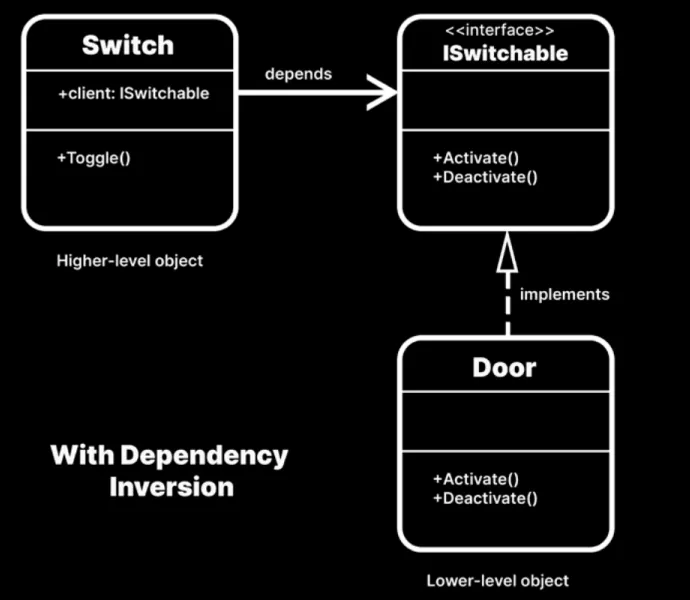
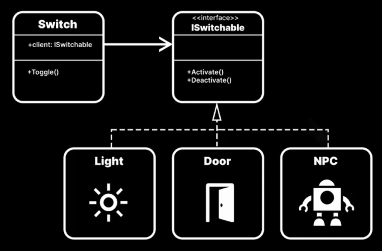

# Dependency inversion principle 依賴倒置原則

高模組不應該直接導入低模組。任何直接來自低模組的東西,都應該以抽象概念作為基礎。

## 判斷方式
低模組以抽象為基礎
- 高模組直接需要 new 低模組，代表可能不是抽象低模組
- 單元測試低模組時，卻需要假高模組的，代表違反 DIP，代表低模組綁死高模組
- 高模組直接持有低模組實體而非抽象，代表違反 DIP

高模組不直接導入低模組
- 假設擴充低模組，會需要修改高模組才能使用，代表違反 DIP

```C#
// 壞例子，Switch(高模組) 直接跟 Door(低模組) 耦合
public class Switch : MonoBehaviour
{
    public Door door;

    public bool isActivated;

    public void Toggle()
    {
        if (isActivated)
        {
            isActivated = false;
            door.Close();
        }
        else
        {
            isActivated = true;
            door.Open();
        }
    }
}
// 壞例子，未來任何修改 Door 時，可能影響到 Switch，代表違反 OCP 開閉原則
public class Door : MonoBehaviour
{
    public void Open() { }
    public void Close() { }
}
```

```C#
// 好例子，增加 ISwitchable 將行為確定
public interface ISwitchable
{
    bool IsActive { get; }

    void Activate();

    void Deactivate();
}

// 好例子，同時 Switch(高模組) 跟 Door(低模組) 避免耦合，形成聚合
// 反轉依存關係，Door 跟 Switch 依賴最上層變更為 ISwitchable
public class Switch : MonoBehaviour
{
    public ISwitchable client;

    public void Toggle()
    {
        if (client.IsActive)
        {
            client.Deactivate();
        }
        else
        {
            client.Activate();
        }
    }
}
// 未來只需要繼承 ISwitchable 就能擴展物件提供給 Switch 使用
public class Door : MonoBehaviour, ISwitchable
{
    private bool isActive;

    public bool IsActive => isActive;

    public void Activate()
    {
        isActive = true;
    }

    public void Deactivate()
    {
        isActive = false;
    }
}
public class Light : MonoBehaviour, ISwitchable
{
    private bool isActive;

    public bool IsActive => isActive;

    public void Activate()
    {
        isActive = true;
    }

    public void Deactivate()
    {
        isActive = false;
    }
}
```

## 其他判斷

- 依賴倒置原則有助於減少類之間的緊密耦合。
 
- 在構建應用程式中的各個類和系統時，有些類屬於"高層級"的，有些則屬於"低層級"的。高層級的類需要依賴低層級的類才能完成某項任務。

- 理想情況下,應盡量減少類之間的依賴關係。每個類的各個組成部分也應能夠協同工作,而非依賴於與外部的連接。當一個對象能夠通過其內部的邏輯來正常運作時,就說它具有內聚性。

- 在理想的情況下,應該追求軟件組件的鬆散耦合與高內聚性。



