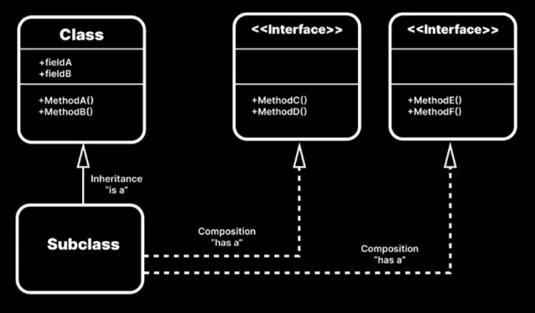
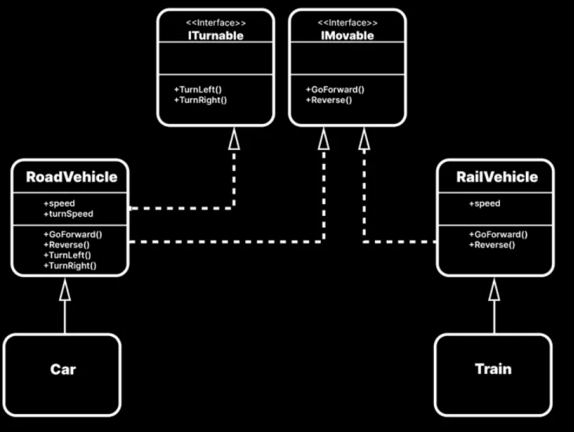

# Liskov substitution principle 里氏替換原則

子類別必須能夠完全替換父類別，行為要符合呼叫者的預期。

## 判斷方式
完全替換：
- 呼叫者如果需要知道子類型別(if(is as))，代表這個父類的行為抽象不夠可靠

符合功能預期：
- 子類繼承後父類後，卻存在不實做的功能，代表無法完全替代父類，違反 LSP
- 子類繼承後父類後，卻存在跟功能語意不符行為，代表無法不符合原本父類功能預期，違反 LSP
- 子類繼承後父類後，功能參數存在預期外的限制，代表這個功能與父類功能流程上歧異，違反 LSP

```C#
// 壞例子，父類提供車輛行為，但對於某些車種來說卻不是必要的
// 代表 Vehicle 本來就不適合於所有車種抽象基類
public class Vehicle
{
    public float speed = 100f;

    public Vector3 direction;

    public void GoForward() { }
    public void Reverse() { }
    public void TurnRight() { }
    public void TurnLeft() { }
}

// Car 完整實作 Vehicle 所有行為，對於 Vehicle 是可以執行所有行為
public class Car : Vehicle { }
Vehicle c = new Train(); // 所有功能能正常執行

// Train 是不需要 TurnRight() 、 TurnLeft() 不會去實作
// 雖然可以被當成 Vehicle 使用，實際上有兩項功能沒有實作
// 對於 Vehicle 出現預期外的結果
public class Train : Vehicle { }
Vehicle v = new Train();
c.GoForward();
c.Reverse();
c.TurnRight(); // 靜默無效
c.TurnLeft(); // 靜默無效
```

```C#
// 好例子，車輛行為抽成介面
public interface ITurnable
{
    void TurnRight();
    void TurnLeft();
}

public interface IMovable
{
    void GoForward();
    void Reverse();
}
// 好例子，為不同行為的車種建立基類
public class RoadVehicle : IMovable, ITurnable
{
    public float speed = 100f;

    public float turnSpeed = 5f;

    public void GoForward() { }
    public void Reverse() { }
    public void TurnRight() { }
    public void TurnLeft() { }
}

public class RailVehicle : IMovable
{
    public float speed = 100f;

    public void GoForward() { }
    public void Reverse() { }
}

public class Car : RoadVehicle { }
public class Train : RailVehicle { }
```

## 其他判斷

- 各種功能都是透過介面來實現的,而非透過繼承。

- 雖然可以讓 RoadVehicle 和 RailVehicle 都繼承自同一個基類,但在這種情況下,其實並沒有太大的必要這樣做。



