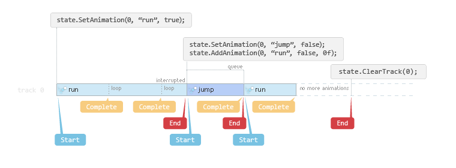

# Uniyt Spine AnimationState

Spine 在 Unity 中負責動畫設置的類別

## 其他相關

+ skeletonAnimation.timeScale - 控制動畫運行速度
+ AnimationReferenceAsset - 動畫檔案的資源，用來直接設置而非搜尋字串
+ TrackEntry - 動畫運行的軌道，保存相關的動畫運行

## 設置動畫

+ SetAnimation() - 設置動畫

```C#
//透過字串搜尋
TrackEntry entry = skeletonAnimation.AnimationState.SetAnimation(trackIndex, "walk", true);
//透過資源黨
public AnimationReferenceAsset animationReferenceAsset;
TrackEntry entry = skeletonAnimation.AnimationState.SetAnimation(trackIndex, animationReferenceAsset, true);
```

+ AddAnimation() - 接續動畫，需要設置延遲， 0 則是在當前播放完畢後接續
```C#
TrackEntry entry = skeletonAnimation.AnimationState.AddAnimation(trackIndex, animationProperty, true, 2);
```

+ SetEmptyAnimation() - 設置空動畫，用來清除當前動畫
+ AddEmptyAnimation() - 接續空動畫，用來清除在列表的接續動畫
+ ClearTrack() - 清除指定的軌道
+ ClearTracks() - 清除所有的軌道
```C#
TrackEntry entry = skeletonAnimation.AnimationState.SetEmptyAnimation(trackIndex, mixDuration);
entry = skeletonAnimation.AnimationState.AddEmptyAnimation(trackIndex, mixDuration, delay);
skeletonAnimation.AnimationState.ClearTrack(trackIndex);
skeletonAnimation.AnimationState.ClearTracks();
```

## 註冊動畫事件



生命週期

1. 动画已开始(started) .
2. 动画被中断(interrupted), 例如清空了一条轨道或设置了一个新的动画.
3. 动画无中断地播放已完成(completed) , 如果是循环动画, 该事件可能会多次出现.
4. 动画已停止(ended) .
5. 动画和其所处的 TrackEntry 已被销毁(disposed) .
6. 触发了用户定义的事件(event).

> 注意: 当设置了一个新动画时, 如果中断了之前的动画, 将不会引发完成(complete)事件,而会引发中断(interrupt)和停止(end)事件.

註冊事件
```C#
animationState = skeletonAnimation.AnimationState;

// registering for events raised by any animation
animationState.Start += OnSpineAnimationStart;
animationState.Interrupt += OnSpineAnimationInterrupt;
animationState.End += OnSpineAnimationEnd;
animationState.Dispose += OnSpineAnimationDispose;
animationState.Complete += OnSpineAnimationComplete;

animationState.Event += OnUserDefinedEvent;

// registering for events raised by a single animation track entry
Spine.TrackEntry trackEntry = animationState.SetAnimation(trackIndex, "walk", true);
trackEntry.Start += OnSpineAnimationStart;
trackEntry.Interrupt += OnSpineAnimationInterrupt;
trackEntry.End += OnSpineAnimationEnd;
trackEntry.Dispose += OnSpineAnimationDispose;
trackEntry.Complete += OnSpineAnimationComplete;
trackEntry.Event += OnUserDefinedEvent;
```

事件如何去對應名稱觸發
```C#
string targetEventName = "targetEvent";
string targetEventNameInFolder = "eventFolderName/targetEvent";

public void OnUserDefinedEvent(Spine.TrackEntry trackEntry, Spine.Event e) {

   if (e.Data.Name == targetEventName) {
      // Add your implementation code here to react to user defined event
   }
}

// you can cache event data to save the string comparison
Spine.EventData targetEventData;
void Start () {
   targetEventData = skeletonAnimation.Skeleton.Data.FindEvent(targetEventName);
}
public void OnUserDefinedEvent(Spine.TrackEntry trackEntry, Spine.Event e) {

   if (e.Data == targetEventData) {
      // Add your implementation code here to react to user defined event
   }
}
```

Spine 提供依據 track 觸發的 yield return
```C#
//WaitForSpineAnimation. 等待, 直到 Spine.TrackEntry 引发一个具体事件.
var track = skeletonAnimation.state.SetAnimation(0, "interruptible", false);
var completeOrEnd = WaitForSpineAnimation.AnimationEventTypes.Complete |
										WaitForSpineAnimation.AnimationEventTypes.End;
yield return new WaitForSpineAnimation(track, completeOrEnd);


//WaitForSpineAnimationComplete. 等待, 直到 Spine.TrackEntry 引发一个 Complete 事件.
var track = skeletonAnimation.state.SetAnimation(0, "talk", false);
yield return new WaitForSpineAnimationComplete(track);


//WaitForSpineAnimationEnd. 等待, 直到 Spine.TrackEntry 引发一个 End 事件.
var track = skeletonAnimation.state.SetAnimation(0, "talk", false);
yield return new WaitForSpineAnimationEnd(track);


//WaitForSpineEvent. 等待, 直到 Spine.AnimationState 引发了一个自定义的 Spine.Event 事件(在Spine编辑器中命名该事件).
yield return new WaitForSpineEvent(skeletonAnimation.state, "spawn bullet");
// You can also pass a Spine.Event's Spine.EventData reference.
Spine.EventData spawnBulletEvent; // cached in e.g. Start()
..
yield return new WaitForSpineEvent(skeletonAnimation.state, spawnBulletEvent);
 
```

## 參考

https://zh.esotericsoftware.com/spine-unity-events