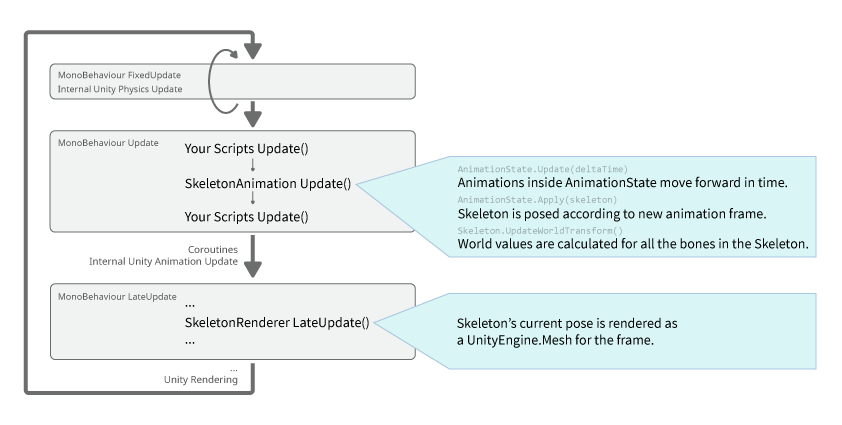

# Unity Spine SkeletonAnimation

Spine 在 Unity 作為組件使用的類別
可以用來調用內部 Skeleton ... 等

## 生命週期



+ `BeforeApply` - 帧动画之前. 用在需要在動畫處理前更改skeleton
+ `UpdateLocal` - 帧动画更新完成且skeleton的 Local 值之后. 用在需要读取或修改 Bone 的 Local 值
+ `UpdateComplete` - 计算完Skeleton中所有 Bone 的 World 值后. SkeletonAnimation在这之后不会在Update中動作. 用在需要读取 Bone 的 World 值
+ `UpdateWorld` - 计算完Skeleton中所有 Bone 的 World 值后. 若订阅了该事件则将二次调用 skeleton.UpdateWorldTransform. 用在需要根据 Bone 的 World 值来修改 Bone 的 Local 值
+ `OnMeshAndMaterialsUpdated` - 在 LateUpdate() 结束后,在网格和所有materials都被更新后引发.

## 掛載

比照其他組件使用方式

```C#
SkeletonAnimation skeletonAnimation;
Spine.AnimationState animationState;
Spine.Skeleton skeleton;

void Awake () {
	skeletonAnimation = GetComponent<SkeletonAnimation>();
	skeleton = skeletonAnimation.Skeleton;
	//skeletonAnimation.Initialize(false); 當不訪問骨架時。使用initialize（false）確保所有內容都已加載。
	animationState = skeletonAnimation.AnimationState;
}
```

## 覆蓋特定部位材質

+ CustomMaterialOverride() - 

> 注意: 请勿使用 originalMaterial = skeletonAnimation.GetComponent<MeshRenderer>().material 因为 .material 会返回一个PrimaryMaterial的实例拷贝, 而非材质本身. 同样也不建议使用 originalMaterial = skeletonAnimation.GetComponent<MeshRenderer>().sharedMaterial, 因为还没有给PrimaryMaterial赋值的时候(例如, 当活动帧尚无活动附件, 或者语句被过早调用时), 该语句可能会返回null.

設置新的材質
```C#
// Use the following code to programmatically query the original material, see note below.
// MeshRenderer.material will not work, MeshRenderer.sharedMaterial might fail in some cases.
if (originalMaterial == null)
   originalMaterial = skeletonAnimation.SkeletonDataAsset.atlasAssets[0].PrimaryMaterial;

//所有材質
skeletonAnimation.CustomMaterialOverride[originalMaterial] = newMaterial; // to enable the replacement.
skeletonAnimation.CustomMaterialOverride.Remove(originalMaterial); // to disable that replacement.

//特定 Slot 材質
skeletonAnimation.CustomSlotMaterials[slot] = newMaterial; // to enable the replacement.
skeletonAnimation.CustomSlotMaterials.Remove(slot); // to disable that replacement.
```

```C#
//要修改顏色在此完成
SkeletonAnimation.UpdateComplete += chageColor();

public Color color = Color.white;
...
skeleton = GetComponent<SkeletonRenderer>().Skeleton;
...
skeleton.R = color.r;
skeleton.G = color.g;
skeleton.B = color.b;
skeleton.A = color.a;


C#slot = skeleton.FindSlot(slotname);
...
slot.R = slotColor.r;
slot.G = slotColor.g;
slot.B = slotColor.b;
slot.A = slotColor.a;
```

使用 MaterialPropertyBlock 修改材質屬性
```C#
MaterialPropertyBlock mpb = new MaterialPropertyBlock();
mpb.SetColor("_FillColor", Color.red); // "_FillColor" is a named property on the used shader.
mpb.SetFloat("_FillPhase", 1.0f); // "_FillPhase" is another named property on the used shader.
GetComponent<MeshRenderer>().SetPropertyBlock(mpb);

// to deactivate the override again:
MaterialPropertyBlock mpb = this.cachedMaterialPropertyBlock; // assuming you had cached the MaterialPropertyBlock
mpb.Clear();
GetComponent<Renderer>().SetPropertyBlock(mpb);`
```