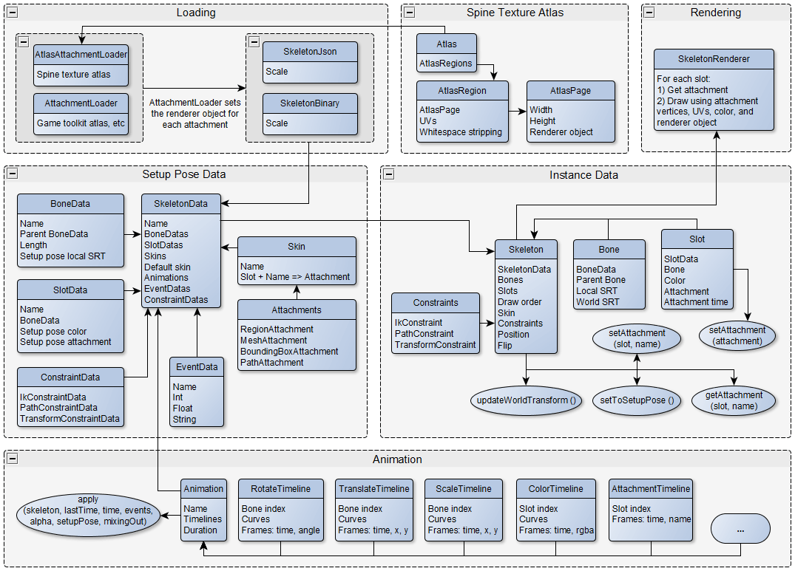

# Unity Spine 基礎

## 名詞


> `SkeletonAnimation` `SkeletonUtility` 等，是 Unity 專用的類別
> 此處的類別是運行 runtime ，部分引擎的類別不在此

Spine 類別
| 英文                    | 中文       | 解釋                                                                                                                                                                                                                                                                                                         |
| :---------------------- | :--------- | :----------------------------------------------------------------------------------------------------------------------------------------------------------------------------------------------------------------------------------------------------------------------------------------------------------- |
| AnimationState          | 动画状态   | 动画状态(AnimationState)是一个方便的类, 它包含可用于骨架(skeleton)的一个或多个动画状态. 它有一个"轨道"的概念, 其索引号从零开始. 在每一帧中依次应用每条轨道中的动画, 且可以在动画轨道之上应用动画. 每个轨道都可以队列动画以便稍后播放. 当当前动画发生变化时, 动画状态还可以处理动画间的Mix(比如淡入淡出).     |
| AttachmentLoader        | 附件加载器 | SkeletonJson使用附件加载器(AttachmentLoader)创建附件. 这个钩子函数用于注入自定义的附件实现, 例如实现惰性加载. 附件加载器最常见的用途是用于定制区域附件的图片源.                                                                                                                                              |
| SkeletonBounds          | 骨架边界   | 骨架边界(SkeletonBounds)是一个方便的类, 它使用当前附加的边界框附件为骨架进行碰撞检测.                                                                                                                                                                                                                        |
| SkeletonRenderer        | 骨架渲染器 | 骨架渲染器(SkeletonRenderer)在骨架的绘制顺序中重复遍历各插槽位, 并负责渲染各种附件.                                                                                                                                                                                                                          |

Spine 物件
| 英文                    | 中文       | 解釋                                                                                                                                                                                                                                                                                                         |
| :---------------------- | :--------- | :----------------------------------------------------------------------------------------------------------------------------------------------------------------------------------------------------------------------------------------------------------------------------------------------------------- |
| Skeleton                | 骨架       | 骨架(Skeleton)保存着一个骨架的状态. 这包括当前pose、骨骼、槽位、绘制顺序等.                                                                                                                                                                                                                                  |
| Bone                    | 骨骼       | 一个骨骼包含局部变换(SRT), 其子骨骼也会继承该变换. 一个骨骼也有世界变换, 它是所有父骨骼变换与局部变换的组合. 世界变换使用和根骨骼相同定义的坐标系.                                                                                                                                                           |
| Slot                    | 槽位       | 槽位(Slot)是骨骼上的一个占位符. 一个槽位既可包含一个附件也可不包含附件. 它也有自己的颜色且记录其附件切换后的保持时长.                                                                                                                                                                                        |
| Skin                    | 皮肤       | 皮肤(Skin)是一个映射(map), 其键(key)是槽位和名称, 值为附件. 皮肤是一个间接层, 它可以按槽位和名称来找到某个附件. 例如, 一个皮肤可能的键为[slot:head,name:head], 值为[attachment:redHead]. 另一个皮肤的同样的键值则为[attachment:greenHead]. 在动画中使用名称可使具有不同附件的骨架通过改变附件的方法复用动画. |
| Attachment              | 附件       | 附件(Attachment)放置在槽位中, 由此便附加于骨骼上. 它可以是一块texture区域也可以是边界框.                                                                                                                                                                                                                     |
| Bounding box attachment | 撞击附件   | 一个用于执行撞击检测、物理模拟等功能的多边形附件.                                                                                                                                                                                                                                                            |
| Region attachment       | 区域附件   | 一个附件(attachment)包含一个纹理(texture)区域和一个偏移SRT, 这个偏移量用于对齐相对于附件的骨骼区域.                                                                                                                                                                                                          |
| Draw order              | 绘制顺序   | 绘制顺序(Draw order)是骨架(skeleton)上槽位的一个列表. 该列表的顺序表示从后到前绘制每个槽位中附件的顺序.                                                                                                                                                                                                      |
| Animation               | 动画       | 动画(Animation)是一个存储了多条时间轴的列表. 每条时间轴都存储着许多关键帧, 每个关键帧都包含一个时间点以及一个/多个值. 当应用动画时, 时间轴使用这些关键帧来操作骨架(skeleton)、触发事件等. 动画不会存储任何状态.                                                                                              |

Spine 資源
| 英文                    | 中文       | 解釋                                                                                                                                                                                                                                                                                                         |
| :---------------------- | :--------- | :----------------------------------------------------------------------------------------------------------------------------------------------------------------------------------------------------------------------------------------------------------------------------------------------------------- |
| Atlas                   | 纹理集     | 纹理集(atlas), 也被称为纹理图集(texture atlas), 是一个存储了一个纹理的命名区域. Spine可以打包纹理来新建一个图集, 也可以使用像Texture Packer Pro(大多数运行时使用的是 "libgdx "图集格式)这样的外部工具来创建图集.                                                                                             |
| SkeletonData            | 骨架資料   | 骨架数据(SkeletonData)包含骨架信息(绑定pose的骨骼、槽位、绘制顺序、附件、皮肤等)和动画, 但不保存任何状态. 多个骨架可以共享同一个骨架数据                                                                                                                                                                     |
| SkeletonJson            | 骨架JSON   | 用于从JSON中加载SkeletonData.                                                                                                                                                                                                                                                                                |

其他(不確定用處)
| 英文                    | 中文       | 解釋                                                                                                                                                                                                                                                                                                         |
| :---------------------- | :--------- | :----------------------------------------------------------------------------------------------------------------------------------------------------------------------------------------------------------------------------------------------------------------------------------------------------------- |
| SRT                     | 缩放       | 缩放(Scale)、旋转(Rotation)和平移(Translation). 也被称为"变换(transform)".                                                                                                                                                                                                                                   |
| Transform               | 空間變換   | 缩放(Scale)、旋转(Rotation)和平移(Translation).                                                                                                                                                                                                                                                              |
| Mixing                  | 混合       | 混合(Mixing), 也被称为淡入淡出, 是通过在当前pose和动画pose间进行线性混合(blend)来使用动画的一种方式.                                                                                                                                                                                                         |


## Spine Attribute

Spine 在 Unity 提供的 Attribute
<br>以下用在 Inspector 用來搜尋對用資料

```C#
[SpineBone] public string bone;
[SpineSlot] public string slot;
[SpineAttachment] public string attachment;
[SpineSkin] public string skin;
[SpineAnimation] public string animation;
[SpineEvent] public string event;
[SpineIkConstraint] public string ikConstraint;
[SpineTransformConstraint] public string transformConstraint;
[SpinePathConstraint] public string pathConstraint;
```

## 方法

+ 如何放置 Spine 到場景
  + 從資源拖曳 Skeleton Data Asset 到場景，自動包裝
  
+ `SkeletonMecanim` - Spine 對應 Animator 的組件?
+ `SkeletonRenderer` - `SkeletonAnimation` 的基類，不提供動畫處理，主要用來 UI 變動使用
+ `SkeletonAnimation` - Inspector 介面設置選項
  + Order in Layer - 圖片層級
  + Mask Interaction - 對 `Sprite Mask` 啟用遮罩效果
  + Animation Name - 預設的動畫
  + Loop - 預設的動畫循環
  + Time Scale - 動畫播放的速度(越大越快)
  + Advanced
		+ Z-Spacing - 產生 Z 軸間隔，避免重疊
		+ Add Skeletion Utility - 點擊後生成 `SkeletonUtility`
+ `BoneFollower` - 設置物件自動跟蹤 Spine Bone
+ `PointFollower` - 設置物件自動跟蹤 Spine Attachment
+ `SkeletonRenderSeparator` - 設置 Spine 內部物件圖層層級，
	+ Separator Slot Names - 選擇槽位渲染分層?
	+ Add the missing renderers - 點擊後依據 Spine 圖檔設定生成對應的子物件?
+ `SkeletonUtility` - 用來生成 Spine 骨架 Unity 物件，透過 SkeletonAnimation > Advanced > Add Skeletion Utility 生成
	+ Spawn Hierarchv - 點擊生成 Spine 骨架 Unity 物件，Follow/Override 更隨骨架與可被修改，all bones/Root Only 依據骨架層級生成與只生成 root
+ `SkeletonUtilityBone` - 透過 `SkeletonUtility` 生成的物件，用來代表 Bone
	+ Create 2D/3D Hinge Chain - 選擇的 `SkeletonUtilityBone` 一併至附加 `Box Colider` `Rigidbody` `Hinge Chain` 鏈結成物理
> 注意, 链根节点不再以skeleton的骨骼为父节点, 而是放置在场景的最高层级.这是Unity中使用动量的一个要求.否则链元素将不再受到skeleton运动的影响!
+ `SkeletonRendererCustomMaterials` - 設置特定 slot 的 material


+ `SkeletonAnimation` - 程式內可用方法
  + `AnimationState` - 控制動畫的物件
    + SetAnimation(int trackIndex, Spine.Animation animation, bool loop) - 設置動畫，參數為(軌道，動畫，循環)
    + AddAnimation(int trackIndex, string animationName, bool loop, float delay) - 追加動畫，delay 0 為結束後播放，計算從上一個動畫開始計算，參數為(軌道，動畫，循環，延遲)
    + AddEmptyAnimation(int trackIndex, float mixDuration, float delay) - 追加空洞化，用來當作連續動畫間隔用，delay 0 為結束後播放，(軌道，混和，延遲)
    + GetCurrent(int trackIndex) - 回傳當前在軌道上播放的動畫，否則null，(軌道)
    + Event += (TrackEntry trackEntry, Event e) = > {} - 監聽動畫中觸發的事件，主要配合動畫動作發出聲音
  + `Skeleton` - 物件資料?
    + `Data` - 物件包含的資料
      + FindEvent(eventName) - 回傳 Spine 設置的事件名稱
      + DefaultSkin - 默認 Skin
    + `Skin` - 外觀
	  + SetAttachment(int slotIndex, string name, Attachment attachment) - 設置 Skin 附件?
	  + GetRepackedSkin () - 重新包裝並生成 Skin?，此步驟耗`效能`
    + ScaleX - X 軸的縮放，-值時圖片反向
    + FindBone(string boneName) - 搜尋骨架層集中符合名稱的骨架
    + SetAttachment(string slotName, string attachmentName) - 搜尋對應的 slot 名稱後，顯示對應的 attachment
    + SetSkin(string skinName) - 設置要更換的 skin ，要執行 SetToSetupPose() 後才會顯示
    + SetToSetupPose() - 執行預計更換的 skin，需要先執行 SetSkin()，內部實際為執行 SetBonesToSetupPose(), SetSlotsToSetupPose()
    + RootBone - 根骨架
    + Update (float delta) - 動畫更新的時間?
    + UpdateWorldTransform() - 動畫更新後骨架移動?
  + `SkeletonDataAsset`
  + `state` - 等同`AnimationState`?
		+ GetCurrent(int trackIndex) - 回傳當前在軌道上播放的動畫，否則null
		+ ClearTrack(int trackIndex) - 軌道上刪除所有動畫，骨骼停留在當前
		+ SetEmptyAnimation(int trackIndex, float mixDuration) - 設置一個空的動畫，並丟棄所有動畫，用來清空用

  + SetMeshSettings(MeshGenerator.Settings settings) - 將Mesherator設置應用於SkeletonRenderer及其內部Meshgenerator
  + Initialize(bool overwrite, [bool quiet = false]) - 初始化 Spine 物件?用來主動初始化，true 會強制初始化，false 有初始化則不執行
  + Update(float deltaTime) -  Spine 動畫運行時的一偵時間，只有當 SkeletonAnimation 未被啟用時才有效， 0 只更新不進行動畫
  + LateUpdate() - ?
  + valid - 是否有效，當可見且被初始化後為 true ，否則 false
  + OnRebuild += (SkeletonRenderer skeletonRenderer) = > {}  - 當觸發初始化時自動呼叫
  + AnimationName - 等於 Inspector 介面 Animation Name 變數
  + BeforeApply += (ISkeletonAnimation animated) = > {} - 動畫開始前觸發?
  + UpdateLocal += (ISkeletonAnimation animated) = > {} - 動畫與空間座標前觸發，要修改骨架在此?
  + UpdateWorld += (ISkeletonAnimation animated) = > {} - 骨架與空間座標後觸發，抓取骨架後數值?
  + UpdateComplete += (ISkeletonAnimation animated) = > {} - 骨架與空間座標後觸發，抓取骨架後數值?
  + OnPostProcessVertices += (MeshGeneratorBuffers buffers) => {} - 網格點在動畫之後觸發?
  + `NewSkeletonAnimationGameObject`(SkeletonDataAsset skeletonDataAsset) - SkeletonDataAsset 資料實例化，回傳 SkeletonAnimation


+ `Spine`
  + `TrackEntry` - 動畫軌道物件，常用在 SetAnimation 的回傳
    + AttachmentThreshold - 動畫時間?
    + MixDuration - 混和時間?
  + `Bone` - 動畫骨架，大多使用設定好的約束骨架
  + `EventData` - 事件資料，動畫觸發的 callback
  + `Attachment` - 附件，圖片等
    + GetRemappedClone(...) - 重新複製一份?
  + `Skin` - 外觀
    + GetAttachment (int slotIndex, string name) - 回傳對應的 slotIndex 與 名稱的附件，沒有則 null

+ `SpineAtlasAsset` - 加載儲存 Spine atlas 和 materials
  + `CreateRuntimeInstance`(TextAsset atlasText, Texture2D[] textures, Material materialPropertySource, bool initialize) - 回傳 SpineAtlasAsset
  + `CreateRuntimeInstance`(TextAsset skeletonDataFile, AtlasAssetBase atlasAsset, bool initialize, [float scale = 0.01]) - 回傳 SkeletonDataAsset

+ `SkeletonDataAsset` - ?
  + GetSkeletonData(bool quiet) - Skeleton數據文件中加載，緩存和返回Skeletondata，flase 防止錯誤?
  + AtlasAssetBase[] atlasAssets - 圖檔資源?
    + PrimaryMaterial - 材質
+ `SkeletonData` - ?
  + FindSlotIndex(string slotName) - 回傳對應的 slot index，沒有則 -1
  + FindSkin(string skinName) - 找尋 Skin，沒有則 null

+ `AtlasUtilities`.ClearCache() - 清除緩除中的圖片檔?

+ `SkeletonUtilityConstraint` - Constraint 的基類，要修改 Spine Constraint Bone 座標使用此
	+ DoUpdate () - 要修改 Bone 座標在此修改

+ `AnimationReferenceAsset` - 動畫的資源檔，直接接 Spine 動畫檔案
	+ Initialize() - 動畫的資源檔，初始化
	+ Animation.Apply(Skeleton skeleton, ...) - 將動畫的操作更新至骨架上?

使用 SkeletonUtility 生成骨架物件後，搭配 Hinge Joint 製作依據 Unity 物理牽動

以下是變數銜接編輯器介面用的修飾詞
```C#

//動畫的資源檔，直接接 Spine 動畫檔案
AnimationReferenceAsset animationAsset;
//動畫的資源檔，初始化
animationAsset.Initialize()

// 自動讀取相關的動畫列表，如果當前物件為 SkeletonAnimation，參數自動搜尋相關名稱，沒有則顯示全部
[SpineAnimation("Idle")]
string AnimationName;

// 自動讀取相關的骨架層級，如果當前物件為 SkeletonAnimation 否則讀取 dataField 參數名稱的 SkeletonAnimation 變數
[SpineBone(dataField:"skeletonAnimation")]
string boneName;

// 自動讀取相關的附件
[SpineSlot]
public string eyesSlot;

// 自動讀取相關的附件?
[SpineAttachment(currentSkinOnly: true, slotField: "eyesSlot")]
public string eyesOpenAttachment;
[SpineAttachment(slotField:"gunSlot", skinField:"baseSkinName")]
public string gunKey = "gun";


// 自動讀取相關的外寬
[SpineSkin(dataField: "skeletonDataAsset")]
public string startingSkin;

// ?
[SpineAtlasRegion] 
public string region;

// 自動讀取相關的動畫事件，如果當前物件為 SkeletonAnimation 否則讀取 dataField 參數名稱的 SkeletonAnimation 變數
[SpineEvent(dataField :"skeletonAnimation", fallbackToTextField :true)]
string eventName;
```

以下是 Unity 滑鼠轉換座標轉化為 Spine 空間座標
```C#
Vector3 mousePosition = Input.mousePosition;
Vector3 worldMousePosition = cam.ScreenToWorldPoint(mousePosition);
Vector3 skeletonSpacePoint = skeletonAnimation.transform.InverseTransformPoint(worldMousePosition);
skeletonSpacePoint.x *= skeletonAnimation.skeleton.ScaleX;
skeletonSpacePoint.y *= skeletonAnimation.skeleton.ScaleY;
bone.SetLocalPosition(skeletonSpacePoint);
```

以下是 Spine 如何註冊動畫事件
```C#
skeletonAnimation.Initialize(false);
if (!skeletonAnimation.valid) return;
Spine.EventData eventData = skeletonAnimation.skeleton.Data.FindEvent(eventName);
//(TrackEntry trackEntry, Event e) 
skeletonAnimation.AnimationState.Event += (trackEntry, e) =>
{
	if (eventData == e.Data) OnFoopstep.Invoke();
};
```

以下是 Spine 如何設置連續動畫或過度動畫
```C#
skeletonAnimation.AnimationState.SetAnimation(layerIndex, tranAnime, false);
skeletonAnimation.AnimationState.AddAnimation(layerIndex, toAnime, true, 0f);
```

以下是 Spine 如何設置人物方向
```C#
skeletonAnimation.skeleton.ScaleX = filp ? 1 : -1;
```

以下是 Spine 如何設置人物外觀
```C#
skeletonAnimation.Skeleton.SetSkin(girlSkin ? "goblin" : "goblingirl");
skeletonAnimation.Skeleton.SetToSetupPose();
```

以下是 Spine 如何設置人物外觀，透過生成
```C#
Spine.Skin equipsSkin = new Skin("Equips");

// OPTIONAL: Add all the attachments from the template skin.
Spine.Skin templateSkin = skeletonAnimation.Skeleton.Data.FindSkin(templateSkinName);
if (templateSkin != null)
	equipsSkin.AddAttachments(templateSkin);

skeletonAnimation.Skeleton.Skin = equipsSkin;

skeletonAnimation.Skeleton.SetSlotsToSetupPose();
skeletonAnimation.AnimationState.Apply(skeletonAnimation.Skeleton);
```

以下是 Spine 如何設置人物外觀，透過複製生成?
```C#
collectedSkin = collectedSkin ?? new Skin("Collected skin");
collectedSkin.Clear();
collectedSkin.AddAttachments(skeletonAnimation.Skeleton.Data.DefaultSkin);
collectedSkin.AddAttachments(equipsSkin);

// 2. Create a repacked skin.
// Note: materials and textures returned by GetRepackedSkin() behave like 'new Texture2D()' and need to be destroyed
if (runtimeMaterial)
	Destroy(runtimeMaterial);
if (runtimeAtlas)
	Destroy(runtimeAtlas);
var repackedSkin = collectedSkin.GetRepackedSkin("Repacked skin", skeletonAnimation.SkeletonDataAsset.atlasAssets[0].PrimaryMaterial,
	out runtimeMaterial, out runtimeAtlas, maxAtlasSize : 1024, clearCache: false);
collectedSkin.Clear();

// You can optionally clear the textures cache after each ore multiple repack operations are done.
//AtlasUtilities.ClearCache();
//Resources.UnloadUnusedAssets();

// 3. Use the repacked skin.
skeletonAnimation.Skeleton.Skin = repackedSkin;

skeletonAnimation.Skeleton.SetSlotsToSetupPose();
skeletonAnimation.AnimationState.Apply(skeletonAnimation.Skeleton);
```

以下是 Spine 使用外觀疊加，製造出人物，必須要在 Spine 事先做好
```C#
Skin characterSkin;

//對 Skin 設置名稱與內容
var skeleton = skeletonAnimation.Skeleton;
var skeletonData = skeleton.Data;
characterSkin = new Skin("character-base");
//結果皮膚是由呼叫返回的skeletondata.findskin（）
//可以在start（）中被緩存一次，而不是尋找同一皮膚

//人物部分
characterSkin.AddSkin(skeletonData.FindSkin(baseSkin));
characterSkin.AddSkin(skeletonData.FindSkin(noseSkins[activeNoseIndex]));
characterSkin.AddSkin(skeletonData.FindSkin(eyelidsSkin));
characterSkin.AddSkin(skeletonData.FindSkin(eyesSkins[activeEyesIndex]));
characterSkin.AddSkin(skeletonData.FindSkin(hairSkins[activeHairIndex]));

//衣服部分
var resultCombinedSkin = new Skin("character-combined");
resultCombinedSkin.AddSkin(characterSkin);
combinedSkin.AddSkin(skeletonData.FindSkin(clothesSkin));
combinedSkin.AddSkin(skeletonData.FindSkin(pantsSkin));
if (!string.IsNullOrEmpty(bagSkin)) combinedSkin.AddSkin(skeletonData.FindSkin(bagSkin));
if (!string.IsNullOrEmpty(hatSkin)) combinedSkin.AddSkin(skeletonData.FindSkin(hatSkin));

//重新設置 Skin
skeleton.SetSkin(resultCombinedSkin);
skeleton.SetSlotsToSetupPose();
```

以下是 Spine 使用 Skin 程式自訂?
```C#
// STEP 0: 創建一份空 Skin
customSkin = new Skin("custom skin"); 
// 找到預計複製的 Skin
var templateSkin = skeleton.Data.FindSkin(templateAttachmentsSkin);

//步驟1  ：使用精靈的“裝備”項目
//步驟1.1：找到原始/模板附件。
//步驟1.2：獲取原始/模板附件的克隆。
//步驟1.3：將精靈圖像應用於克隆。
//步驟1.4：將重新映射的克隆添加到新的自定義皮膚中。

// 可是使用 string 取得，但索引會更快
int visorSlotIndex = skeleton.FindSlotIndex(visorSlot);
Attachment templateAttachment = templateSkin.GetAttachment(visorSlotIndex, visorKey); // STEP 1.1
Attachment newAttachment = templateAttachment.GetRemappedClone(visorSprite, sourceMaterial, pivotShiftsMeshUVCoords : false); // STEP 1.2 - 1.3
//注意：每次呼叫`getRemappedclone（）`帶有參數`premultiplyalpha`設置為true`創建
//一個緩存的紋理副本，可以通過在下面的方法中調用 atlasutilities.clearcache（）來清除。
customSkin.SetAttachment(visorSlotIndex, visorKey, newAttachment); // STEP 1.4

// 附件對象，這裡步驟與上面一樣
int gunSlotIndex = skeleton.FindSlotIndex(gunSlot);
Attachment templateGun = templateSkin.GetAttachment(gunSlotIndex, gunKey); // STEP 1.1
Attachment newGun = templateGun.GetRemappedClone(gunSprite, sourceMaterial, pivotShiftsMeshUVCoords: false); // STEP 1.2 - 1.3
customSkin.SetAttachment(gunSlotIndex, gunKey, newGun); // STEP 1.4


//步驟3：申請並清理。
//建議，最好在級別載荷時間：重新包裝自定義皮膚以最大程度地減少呼叫
//重要說明：getRepackedSkin（）操作很昂貴 - 如果多個字符
//需要每隔幾秒鐘稱呼每隔幾秒鐘就會超過抽獎電話的好處。
//
//重新包裝要求您將所有源紋理/精靈/地圖集設置為在檢查器中啟用/寫入。
//將所有附件源混合到一個皮膚中。通常，這意味著默認的皮膚和自定義皮膚。
//致電Skin.GetRepackedSkin，以獲得帶有克隆附件的克隆皮膚，它們都使用一種紋理。
if (repack)	{ // 是否重新包裝(自行 Destroy 材質 圖片)
  var repackedSkin = new Skin("repacked skin");
  repackedSkin.AddAttachments(skeleton.Data.DefaultSkin); // “默認” Skin （皮膚佔位持有人之外的一切）
  repackedSkin.AddAttachments(customSkin); // 自訂 Skin
  // 注意：GetRepackedSkin（）返回的材料和紋理的行為就像“ new Texture2d（）”，需要被銷毀
  if (runtimeMaterial)
    Destroy(runtimeMaterial);
  if (runtimeAtlas)
    Destroy(runtimeAtlas);
  // 包裝皮膚中的所有物品
  repackedSkin = repackedSkin.GetRepackedSkin("repacked skin", sourceMaterial, out runtimeMaterial, out runtimeAtlas);
  skeleton.SetSkin(repackedSkin); // 將重新包裝的皮膚分配給骨骼
  if (bbFollower != null) bbFollower.Initialize(true);
} else {
  skeleton.SetSkin(customSkin); // 只需直接使用定制的皮膚即可。
}

skeleton.SetSlotsToSetupPose(); // 使用設置姿勢的姿勢。
skeletonAnimation.Update(0); // 在當前活動的動畫中使用姿勢。

//`getRepackedSkin（）
//緩存必須創建紋理副本，可以通過調用 AtlasUtilities.ClearCache()來清除。
//多次重新包裝操作後，您可以選擇清除紋理緩存。
//請注意，雖然此清理可以釋放內存，但它也是一個昂貴的操作
//並且可能會在幀率上引起尖峰。
AtlasUtilities.ClearCache();
Resources.UnloadUnusedAssets();
```

以下是 Spine 如何移除外觀中所有已設置的附件
```C#
customskin.removeattachment（gunslotindex，gunkey）; //刪除項目。
customskin.clear（）
//使用skin.clear（）刪除所有自定義。
//如果自定義在此定義，則自定義將落後於默認皮膚中的值。
//為了防止回退的發生，請確保在默認皮膚中未定義鍵。
```

以下是 Spine 如何設置更換物件內的顯示對象
```C#
if (girlSkin) {
	skeletonAnimation.Skeleton.SetAttachment("left-hand-item", "spear");
} else
	skeletonAnimation.Skeleton.SetAttachment("left-hand-item", "dagger");
```

以下是 Spine 如何設置更換循環更換物件
```C#
[SpineSlot]
public string eyesSlot;

[SpineAttachment(currentSkinOnly: true, slotField: "eyesSlot")]
public string eyesOpenAttachment;

[SpineAttachment(currentSkinOnly: true, slotField: "eyesSlot")]
public string blinkAttachment;

while (true) {
	yield return new WaitForSeconds(Random.Range(0.25f, 3f));
	skeletonAnimation.Skeleton.SetAttachment(eyesSlot, blinkAttachment);
	yield return new WaitForSeconds(blinkDuration);
	skeletonAnimation.Skeleton.SetAttachment(eyesSlot, eyesOpenAttachment);
}
```
以下是 Spine 如何透過 Atlas 更換對應的物件 ?
```C#
Atlas atlas = atlasAsset.GetAtlas();
float scale = skeletonRenderer.skeletonDataAsset.scale;

foreach (var entry in attachments) {
  Slot slot = skeletonRenderer.Skeleton.FindSlot(entry.slot);
  Attachment originalAttachment = slot.Attachment;
  AtlasRegion region = atlas.FindRegion(entry.region);

  if (region == null) {
    slot.Attachment = null;
  } else if (inheritProperties && originalAttachment != null) {
    slot.Attachment = originalAttachment.GetRemappedClone(region, true, true, scale);
  } else {
    var newRegionAttachment = region.ToRegionAttachment(region.name, scale);
    slot.Attachment = newRegionAttachment;
  }
}
```

以下是 Spine 如何無視動畫直接更改骨架座標
```C#
Vector2 worldPos;
Bone footBone;

skeletonAnimation.UpdateLocal += (animated) => {
	footBone.SetLocalPosition(thisTransform.InverseTransformPoint(worldPos));
};
```

以下是 Spine 如何自訂偵數播放動畫進行
```C#
// Spine 運行的偵
float frameDeltaTime;
// Unity 運行時間超出時，最大跳躍 Spine 運行的偵數
int maxFrameSkip;

float frames;
float accumulatedTime;
bool requiresNewMesh;

void Update () {
	if (skeletonAnimation.enabled) skeletonAnimation.enabled = false;

	//累積計算
	accumulatedTime += Time.deltaTime;
	float frames = 0;
	while (accumulatedTime >= frameDeltaTime)
	{
		frames++;
		if (frames > maxFrameSkip) break;
		accumulatedTime -= frameDeltaTime;
	}
		
	if (frames > 0) {
		skeletonAnimation.Update(frames * frameDeltaTime);
		requiresNewMesh = true;
	}
}
				
void LateUpdate () {
	if (!requiresNewMesh) return;

	skeletonAnimation.LateUpdate();
	requiresNewMesh = false;
}
```

以下是 Spine 設置整體顏色修改
```C#
block = new MaterialPropertyBlock();
meshRenderer = GetComponent<MeshRenderer>();

//_Color 代表亮色系，_Black 代表暗色系
block.SetColor("_Color", Color.white);
block.SetColor("_Black", Color.black);
meshRenderer.SetPropertyBlock(block);
```

以下是 Spine 程式生成 Spine SkeletonGraphic UI 物件
```C#
SkeletonDataAsset skeletonDataAsset;
Material skeletonGraphicMaterial; // 必須要是對應的材質

skeletonDataAsset.GetSkeletonData(false); // 從資源加載
SkeletonGraphic sg = SkeletonGraphic.NewSkeletonGraphicGameObject(skeletonDataAsset, this.transform, skeletonGraphicMaterial);
sg.gameObject.name = "SkeletonGraphic Instance";
```

以下是 Spine 程式生成 Spine SkeletonAnimation 物件
```C#
SkeletonDataAsset skeletonDataAsset;

skeletonDataAsset.GetSkeletonData(false); //  從資源加載
SkeletonAnimationvar sa = SkeletonAnimation.NewSkeletonAnimationGameObject(skeletonDataAsset); 
```

以下是 Spine 程式生成 Spine SkeletonAnimation 物件，透過 TextAsset Texture2D Material 資源
```C#
//資源中必要的檔案
TextAsset skeletonJson;
TextAsset atlasText;
Texture2D[] textures;
Material materialPropertySource;
//資源生成必要的資料
SpineAtlasAsset runtimeAtlasAsset = SpineAtlasAsset.CreateRuntimeInstance(atlasText, textures, materialPropertySource, true);
SkeletonDataAsset runtimeSkeletonDataAsset = SkeletonDataAsset.CreateRuntimeInstance(skeletonJson, runtimeAtlasAsset, true);
//資料生成 Unity 物件
runtimeSkeletonDataAsset.GetSkeletonData(false); // preload.
SkeletonAnimation sa = SkeletonAnimation.NewSkeletonAnimationGameObject(runtimeSkeletonDataAsset);
sa.transform.Translate(Vector3.down * 2);
```

以下是 Spine 骨架物件修改位置
```C#
//生成 Spine 骨架物件，繼承 SkeletonUtilityConstraint 在 DoUpdate() 修改 bone.bone.X/y
class SkeletonUtilityGroundConstraint : SkeletonUtilityConstraint 

	public override void DoUpdate () {
		...
		bone.bone.X = transform.localPosition.x / hierarchy.PositionScale;
		bone.bone.Y = transform.localPosition.y / hierarchy.PositionScale;
	}
}
```

以下是 Spine 利用 SkeletonRenderer 設置動畫
```C#
public float fillPercent = 0;
public AnimationReferenceAsset fillAnimation;
SkeletonRenderer skeletonRenderer;


Skeleton skeleton = skeletonRenderer.skeleton;

fillAnimation.Animation.Apply(skeleton, 0, percent, false, null, 1f, MixBlend.Setup, MixDirection.In);
skeleton.Update(Time.deltaTime);
skeleton.UpdateWorldTransform();
```

以下是 Spine 利用 SkeletonRenderer 設置動畫
```C#
skeletonRenderer.OnPostProcessVertices += ProcessVertices;

void ProcessVertices (MeshGeneratorBuffers buffers) {
	if (!this.enabled) return;

	int vertexCount = buffers.vertexCount; // 抓取 vertexCount 較高效能
	Vector3[] vertices = buffers.vertexBuffer;// 修改網格 Vector3[] vertexBuffer

	for (int i = 0; i < vertexCount; i++)
		vertices[i] += (Vector3)(Random.insideUnitCircle * jitterMagnitude);

	//您還可以修改紫外線和顏色。
	// var uvs = buffer.uvbuffer;
	// var colors = buffer.colorbuffer;
}

void OnDisable () {
	skeletonRenderer.OnPostProcessVertices -= ProcessVertices;
}
```

## 參考

http://zh.esotericsoftware.com/spine-runtimes-guide
http://zh.esotericsoftware.com/spine-runtime-terminology
http://zh.esotericsoftware.com/spine-api-reference
http://zh.esotericsoftware.com/spine-unity